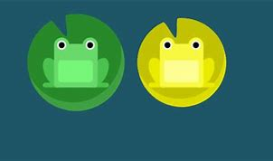

<!DOCTYPE html>
<html lang="en">
<head>
    <meta charset="UTF-8">
    <meta name="viewport" content="width=device-width, initial-scale=1.0">
    <title>Cards</title>
    <link rel="stylesheet" href="./style.css">
    <link rel="stylesheet" href="https://cdnjs.cloudflare.com/ajax/libs/font-awesome/6.6.0/css/all.min.css"/>
</head>
<body>
    

        

            

            

                
<h2 class="card-title">Periodic Table</h2>
                
This is my first first assignment of periodic Table .

                <a href="https://classroom.google.com/u/1/a/turned-in/all?hl=en" class="card-button">View Code</a>
                <a href="./New folder/Assignment of periodic table/Assignment.html" class="card-button">View site</a>

            

        

        

            

            

                <h2 class="card-title">Facebook Login Page</h2>
                
This is my facebook login page assignment.

                <a href="https://github.com/SyedTanveerAhmed1999/Facebook" class="card-button">View code</a>
                <a href="./New folder/Assignment facebook login/inder.html" class="card-button">View site</a>
            

        

        

            

            

                <h2 class="card-title">Apple Clone </h2>
                
 This is my apple clone home page website .

                <a href="https://github.com/SyedTanveerAhmed1999/A-Apple" class="card-button">View code</a>
                <a href="./New folder/Apple/index.html" class="card-button">View site</a>
            

        

        

            

            

                <h2 class="card-title">Color Palette</h2>
                
This is a description of my color palatte creating by me .

                <a href="https://github.com/SyedTanveerAhmed1999/Color" class="card-button">View code</a>
                <a href="./New folder/Color Palate/index.html" class="card-button">View site</a>
            

        

        

            

            

                <h2 class="card-title">Flex Froggy</h2>
                
This is only a practice for Flex where i clear all 25/25 level. 

                <a href="#" class="card-button">View code</a>
                <a href="./img/1122334455.pngx" class="card-button">View site</a>
            

        

        

            

            

                <h2 class="card-title">Alphabet Book</h2>
                
This is My Alphabet Book for practice purpose. 

                <a href="#" class="card-button">View code</a>
                <a href="./New folder/Assignment of book/book.html" class="card-button">View site</a>
            

    

    
  
    

        <a href="#" class="extra-button"><i class="fa-solid fa-arrow-up"></i></a>
    

</body>
</html>
